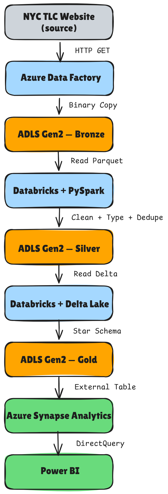

# Data Engineering Portfolio

Azure-based data engineering projects demonstrating end-to-end 
pipeline design, data modeling, and cloud data infrastructure.

## Tech Stack

## Projects

### NYC Taxi Medallion Lakehouse *(in progress)*
End-to-end batch pipeline ingesting NYC TLC yellow taxi data 
through a medallion architecture on Azure.

**Pipeline:**
ADF → ADLS Gen2 (Bronze) → Databricks + Delta Lake (Silver) → Synapse (Gold) → Power BI

**Built so far:**
- ADF Copy pipeline with daily schedule trigger
- ADLS Gen2 medallion structure (bronze/silver/gold)
- Python ETL — modular ingestion + dimension loading
- Delta Lake — time travel, schema evolution, OPTIMIZE + Z-ordering
- SCD Type 2 — customer history tracking via Delta MERGE
- Star schema — 7 dimension tables + fact table in MySQL

[View code →](./python-etl/)

### Data Warehouse Design
Star schema designs for food delivery and NYC taxi domains.
Demonstrates dimensional modeling, grain declaration, SCD types,
and role-playing dimensions.

[View →](./data-warehouse-design/)

## About
Software Engineer (4 yrs) transitioning to Data Engineering.
Building production-style Azure data pipelines on the medallion
lakehouse architecture.

📍 Gurugram, India